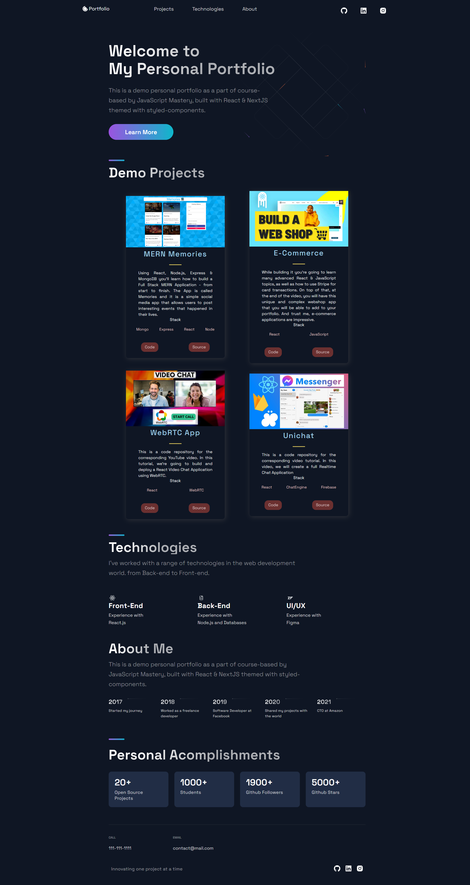

<a name="readme-top"></a>
<div align="center">

  
  

  <h1>Next Portfolio</h1>
  
  <p>
    Next Portfolio is a modern UI/UX and functional Personal Portfolio Web built with React & NextJS
  </p>

<!-- Badges -->
<p>
  <a href="https://github.com/ladunjexa/Next-Portfolio-Web/graphs/contributors">
    
  </a>
  <a href="">
    
  </a>
  <a href="https://github.com/ladunjexa/Next-Portfolio-Web/network/members">
    
  </a>
  <a href="https://github.com/ladunjexa/Next-Portfolio-Web/stargazers">
    
  </a>
  <a href="https://github.com/ladunjexa/Next-Portfolio-Web/issues/">
    
  </a>
  <a href="https://github.com/ladunjexa/Next-Portfolio-Web/blob/master/LICENSE">
    
  </a>
</p>
   
 <h4>
    <a href="https://github.com/ladunjexa/Next-Portfolio-Web/">View Demo</a>
  <span> · </span>
    <a href="https://github.com/ladunjexa/Next-Portfolio-Web">Documentation</a>
  <span> · </span>
    <a href="https://github.com/ladunjexa/Next-Portfolio-Web/issues/">Report Bug</a>
  <span> · </span>
    <a href="https://github.com/ladunjexa/Next-Portfolio-Web/issues/">Request Feature</a>
  </h4>
</div>

<br />

<!-- Table of Contents -->
<details>

<summary>

# :notebook_with_decorative_cover: Table of Contents

</summary>

- [About the Project](#star2-about-the-project)
  * [Folder Structure](#bangbang-folder-structure)
  * [Tech Stack](#space_invader-tech-stack)
- [Getting Started](#toolbox-getting-started)
  * [Installation](#gear-installation)
  * [Run Locally](#running-run-locally)
- [Contributing](#wave-contributing)
- [License](#warning-license)
- [Contact](#handshake-contact)
- [Acknowledgements](#gem-acknowledgements)

</details>  

<!-- About the Project -->
## :star2: About the Project

<div align="center">
  
</div>

<br />

This repository houses an well-designed and functional Personal Portfolio Website consisting Header, Hero, Projects, Technologies, About, Acomplishments and Footer sections built with React & NextJS using styled-components⏭

<!-- Folder Structure -->
### :bangbang: Folder Structure

Here is the folder structure of Next-Portfolio.
```
Next-Portfolio-Web/
|- public/
  |-- images/
|- src/
  |-- components/
  |-- constants/
  |-- layout/
  |-- pages/
  |-- styles/
  |-- themes/
```
<br />

<!-- TechStack -->
### :space_invader: Tech Stack
  


  
<p align="right">(<a href="#readme-top">back to top</a>)</p>

<!-- Getting Started -->
## 	:toolbox: Getting Started

<!-- Installation -->
### :gear: Installation

#### Step 1:
Download or clone this repo by using the link below:

```bash
 https://github.com/ladunjexa/Next-Portfolio-Web
```

#### Step 2:

HooBank using NPM (Node Package Manager), therefore, make sure that Node.js is installed by execute the following command in console:

```bash
  node -v
```

#### Step 3:

At the main folder execute the following command in console to get the required dependencies:

```bash
  npm install
```

#### Step 3:

At the main folder execute the following command in console to run the serevr:

```bash
  npm run start
```
  
<!-- Run Locally -->
### :running: Run Locally

#### Step 1:

At the main folder execute the following command in console to run the development server:

```bash
  npm run dev
```

<p align="right">(<a href="#readme-top">back to top</a>)</p>

<!-- Contributing -->
## :wave: Contributing

<a href="https://github.com/ladunjexa/Next-Portfolio-Web/graphs/contributors">
  
</a>


Contributions are always welcome!

See [`contributing.md`](https://contributing.md/) for ways to get started.

Contributions are what make the open source community such an amazing place to learn, inspire, and create. Any contributions you make are **greatly appreciated**.

If you have a suggestion that would make this better, please fork the repo and create a pull request. You can also simply open an issue with the tag "enhancement".
Don't forget to give the project a star! Thanks again!

1. Fork the Project
2. Create your Feature Branch (`git checkout -b feature/AmazingFeature`)
3. Commit your Changes (`git commit -m 'Add some AmazingFeature'`)
4. Push to the Branch (`git push origin feature/AmazingFeature`)
5. Open a Pull Request

<p align="right">(<a href="#readme-top">back to top</a>)</p>

<!-- License -->
## :warning: License

Distributed under the MIT License. See [LICENSE.txt](https://github.com/ladunjexa/Next-Portfolio-Web/blob/main/LICENSE) for more information.

<p align="right">(<a href="#readme-top">back to top</a>)</p>

<!-- Contact -->
## :handshake: Contact

Liron Abutbul - [@lironabutbul6](https://twitter.com/lironabutbul6) - [@ladunjexa](https://t.me/ladunjexa)

Project Link: [https://github.com/ladunjexa/Next-Portfolio-Web](https://github.com/ladunjexa/Next-Portfolio-Web)

<p align="right">(<a href="#readme-top">back to top</a>)</p>

<!-- Acknowledgments -->
## :gem: Acknowledgements

This section used to mention useful resources and libraries that used in Next-Portfolio

 - [styled components](https://styled-components.com/)
 - [styled normalize](https://www.npmjs.com/package/styled-normalize)
 - #JSMastery

<p align="right">(<a href="#readme-top">back to top</a>)</p>
